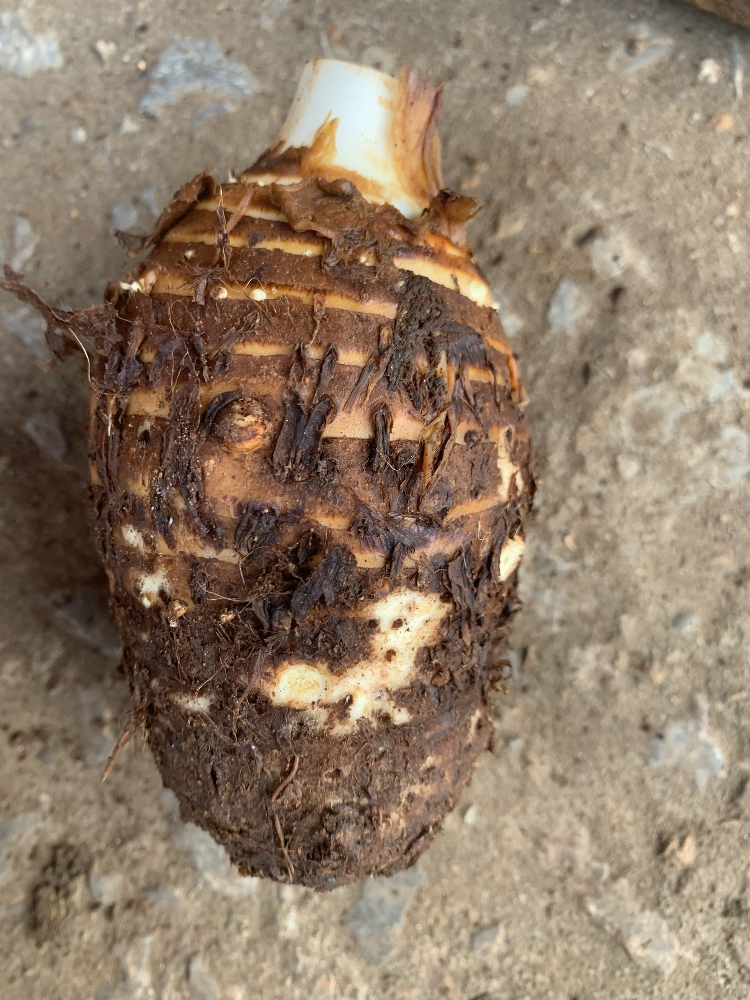

# Taro-Disease-Classification

[

This repository contains a deep learning solution for classifying diseases in Taro plants using convolutional neural networks (CNN), ensemble deep learning, and transfer learning with popular architectures such as VGG and ResNet. Additionally, the model is deployed in a Streamlit web application for user-friendly interaction.

## Project Structure

- **requirements.txt:** This file lists all the dependencies required to run the project. You can install them using `pip install -r requirements.txt`.

- **util.py:** This Python script includes utility functions used in the main project files.

- **main.py:** The main script for the Streamlit web application. It provides a user interface for uploading images and obtaining predictions from the trained model.

- **classify.ipynb:** A Jupyter notebook containing the code for training the deep learning model, including CNN, ensemble deep learning, and transfer learning with VGG and ResNet. It also covers the evaluation of the model's performance.

## Getting Started

1. **Clone the repository:**

   ```bash
   git clone https://github.com/your-username/Taro-Disease-Classification.git
   cd Taro-Disease-Classification
2. **Install dependencies:**
   ```bash
   pip install -r requirements.txt
3. **Run the Streamlit web application:**
   ```bash
   streamlit run main.py
Visit http://localhost:8501 in your web browser to interact with the application.

## How to Train the Model
Refer to the classify.ipynb Jupyter notebook for details on training the Taro disease classification model. The notebook covers data preparation, model training, and evaluation.
## Note
* Ensure you have the required dependencies installed before running the application or training the model.

* Customize the model architecture, hyperparameters, and training settings according to your specific requirements.

* The provided Jupyter notebook serves as a guide, and you may need to adapt it based on your dataset and project specifications.
